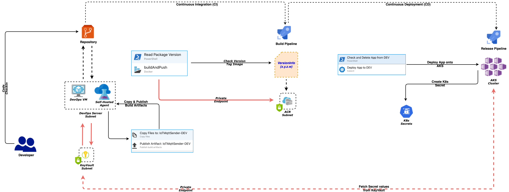

# RatingsWeb

 


### Prelude

This is a simple AngularJs frontend app which we intend to deploy in an AKS cluster and make entire process automated.

### Folders

Following is the folder structure followed and baked into Azure DevOps process to pickup files and deploy accordingly -

- **Source** - Contains the AngularJS source code

- **YAMLs/DEV** - Contains the k8s deployment and service files for DEV namespace (read *Tier)*. Similar folders for other *tiers* would be added here

  

  - #### ratingsweb-deployment.yaml

  ```yaml
  apiVersion: apps/v1
  kind: Deployment
  metadata:
    name: ratingsweb-deploy
    namespace: aks-workshop-dev
  spec:
    selector:
        matchLabels:
          app: ratingsweb-pod
    replicas: 1
    template:
        metadata:
          labels:
              app: ratingsweb-pod
        spec:
          containers:
          - name: ratingsweb-app
            image: akswkshpacr.azurecr.io/ratingsweb:v1.4.1
            imagePullPolicy: IfNotPresent
            readinessProbe:
              httpGet:
                port: 8080
                path: /
            livenessProbe:
              httpGet:
                port: 8080
                path: /
            resources:
              requests:
                memory: "64Mi"
                cpu: "250m"
              limits:
                memory: "512Mi"
                cpu: "500m"
            env:
            - name: API
              value: http://ratingsapi-svc.aks-workshop-dev.svc.cluster.local
            ports:
            - containerPort: 8080
          imagePullSecrets:
          - name: aks-workshop-secret
          nodeSelector:
            agentpool: akswkpool
            
  ```

  

  - #### ratingsweb-service.yaml

  ```yaml
  apiVersion: v1
  kind: Service
  metadata:
    name: ratingsweb-service
    namespace: aks-workshop-dev
  spec:
    selector:
      app: ratingsweb-pod
    ports:
    - protocol: TCP
      port: 80
      targetPort: 8080
    type: ClusterIP
  ```

  **Note**: Please note the Service type - *ClusterIP*. This makes the inaccessible from external clients and we would need a LoadBalancer service to connect to that; basically a Ingress router is needed that can Loadbalance as well as route to appropriate service paths - considering there would be many more services in a real world system

Now since we know the folder structure and what file is going into it...let us see how to automate the deployment of this application using Azure DevOps.

*Please note that this example runs in a self-hosted agent running on a Ubuntu machine*

## Automation

### Pre-Requisites

- Self-hosted *<u>Ubuntu VM 2 Core 4GB</u>* or higher one
- *Self-hosted Agent* installed on the VM - https://docs.microsoft.com/en-us/azure/devops/pipelines/agents/v2-linux?view=azure-devops
- *Azure Container Registry (ACR)* - is already deployed and configured - as part of Cluster creation process
- *Azure KeyVault* - is already deployed and necessary *Secrets* added - as part of Cluster creation process
- *Azure CLI* for for Linux is installed on the VM
- *Docker* for Linux is installed on the VM; Docker group is added to the system group to have higher privileges during build and deployment process. This is because - *sudo* command being interactive won't work in an automated environment like devops
- *Kubectl* for Linux is installed on the VM
- *PowerShell Core* installed on the VM
- Subnet of DevOps machine should be part of Private Endpoint from *ACR*
- Subnet of DevOps machine should be part of Private Endpoint from *KeyVault*

### Continuous Integration (CI)

- Build step of the application code
- Azure DevOps would have a listener for code changes in the respective repository - *GitHub in this case*
- Once the listener is invoked -
  - A *PowerShell Task* would Read the version info from package, json file; extract package version and add this to a local pipeline variable (*as shown below*)
  - *Docker Build and Push Task* would fetch the package version from local pipeline variable and prepare an image tag for  the docker build to work on
  - The built image would then be pushed to container registry as setup in the Task config page
  - *Build Artefacts* are zipped and Published into a location in Self-hosted agent file system (*to be picked up by subsequent Deployment process*)

##### Read Package Task

```powershell
# Write your PowerShell commands here.

$settingsInfo = Get-Content -Path $(packageFilePath) -Raw | ConvertFrom-Json
$versionInfo = $settingsInfo.Version
Write-Host $versionInfo
Write-Host "##vso[task.setvariable variable=pkgVersion]$versionInfo"

```


### Continuous Deployment (CD)

- Once the build is finished, automatic deployment process would pick up the *Build Artefacts* from Self-hosted agent file system
- Check and Delete existing App from the cluster
- Deploy new version to cluster using *Kubectl Apply Task*

*Please note that - these two steps can be replaced by a Rolling Update script - may be something that reader can try out?*

Let us have a quick look at the script(s) of various tasks performed during this process -

##### Check and Delete App from DEV

```powershell
$deployName = $(kubectl get deploy.apps -n $(projectName)-dev -o=jsonpath="{.items[?(@.metadata.name==$(deploymentName))].metadata.name}")

Write-Host $deployName

if ($deployName -eq $(deploymentName))
{
    
     kubectl delete deploy/$deployName -n $(projectName)-dev

}
```


**Ref:**

- Source - https://github.com/monojit18/RatingsWeb
- AKS Docs - https://docs.microsoft.com/en-us/azure/aks/
- Azure DevOps - https://docs.microsoft.com/en-us/azure/devops/pipelines/?view=azure-devops